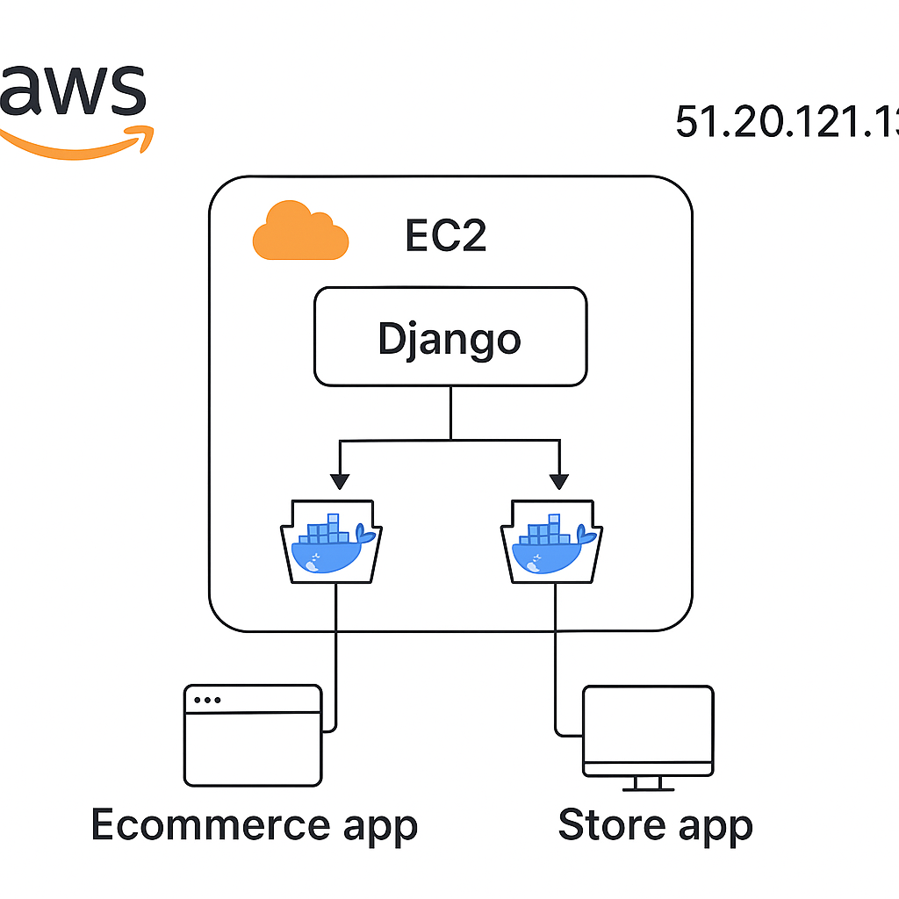

# E-Commerce (Django) — DevOps Pipeline

## 🚀 Project Overview  
This project demonstrates a complete **DevOps pipeline** for a Django-based e-commerce web application — covering **containerization**, **infrastructure automation**, **continuous integration and deployment**, **monitoring**, and **DevSecOps** practices.

## Key Components
- **Source Control:**  
  Managed on **GitHub** with a clear branching strategy (`master` for demo deployment).

- **CI/CD Pipeline (GitHub Actions):**  
  Automates the following stages: 
  - Build and tag Docker images  
  - Scan images with **Trivy** (for vulnerabilities)  
  - Push images to **DockerHub**  
  - Deploy automatically to **AWS EC2**

- **Infrastructure as Code (IaC):**  
  Infrastructure provisioned using **Terraform** under the `infra/` directory.  
  - Creates EC2 instance  
  - Configures security groups  
  - Deploys the containerized app to AWS  
  - Can be extended to include S3, IAM roles, etc.

- **Containerization:**  
  - App is fully **Dockerized** with separate services (database).  
  - **Docker Compose** is used for local multi-container orchestration.

- **Monitoring & Observability:**  
  - Integrated **Prometheus** and **Grafana** via Docker Compose under the `monitoring/` directory.  
  - Monitors server and application metrics.

- **DevSecOps:**  
  - Image scanning integrated with **Trivy** to detect vulnerabilities early in the CI pipeline.  
  - Basic secret management using environment variables (`.env` file).

---

## Live Endpoints
- http://51.20.121.132:8000/products --> Fetches All Products
- http://51.20.121.132:8000/products/1 --> Fetches a single product

## Architecture Diagram

## Run locally
1. Activate venv: `source .venv/bin/activate`
2. Create `.env` (see example)
3. `docker compose up --build -d`
4. `docker compose exec web python manage.py migrate`
5. `docker compose exec web python manage.py createsuperuser`
6. Visit http://localhost:8000 and admin at /admin
